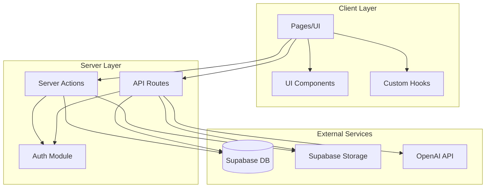
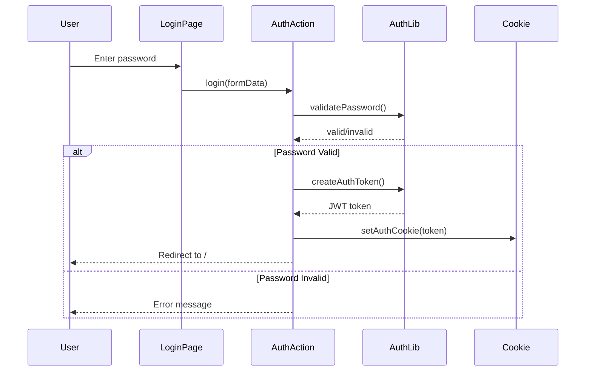
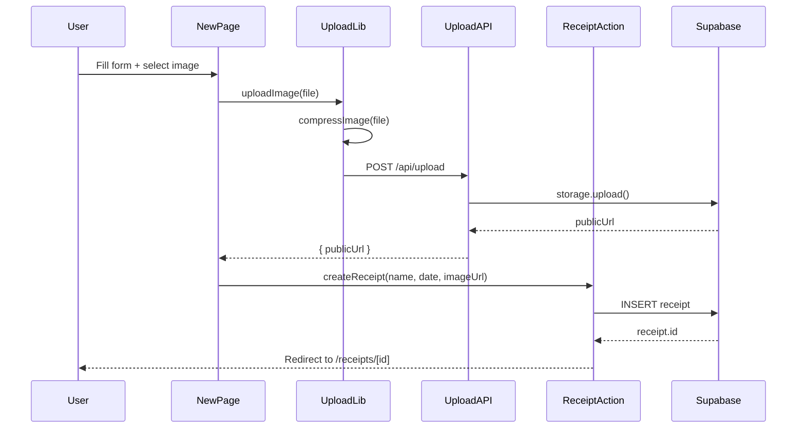
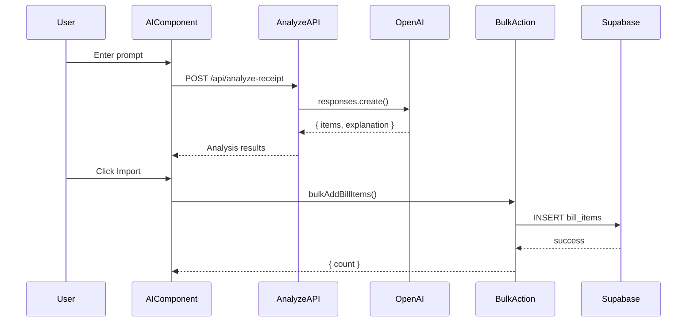
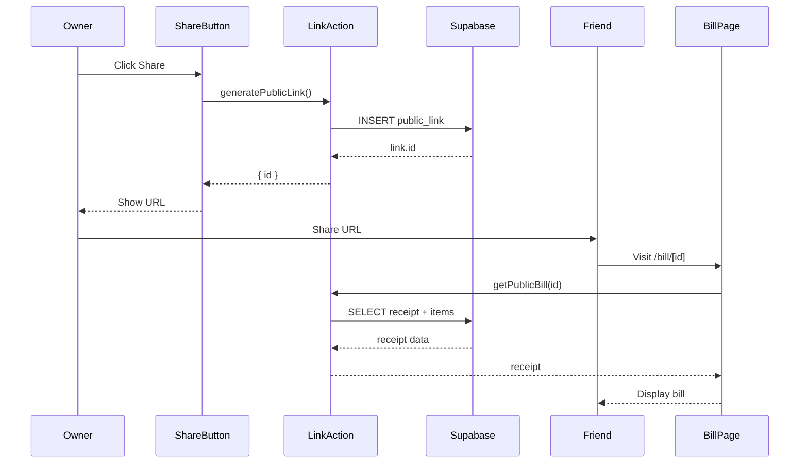

# Architecture Overview

This document describes the technical architecture of Receipt Split, including the tech stack, project structure, and data flow.

## Tech Stack

| Layer | Technology | Version | Purpose |
|-------|------------|---------|---------|
| Framework | Next.js | 16.0.7 | Full-stack React framework with App Router |
| UI Library | React | 19.2.0 | Component-based UI library |
| Styling | Tailwind CSS | 4.x | Utility-first CSS framework |
| Database | Supabase | - | PostgreSQL database with real-time subscriptions |
| Storage | Supabase Storage | - | File storage for receipt images |
| Authentication | jose | 6.1.2 | JWT token generation and verification |
| AI | OpenAI | 6.17.0 | GPT-5.2 for receipt analysis |
| UI Components | Radix UI | - | Accessible, unstyled UI primitives |
| Icons | Lucide React | 0.555.0 | Icon library |
| Image Compression | browser-image-compression | 2.0.2 | Client-side image optimization |

## Project Structure

```
Taxes/
├── app/                          # Next.js App Router
│   ├── actions/                  # Server Actions
│   │   ├── auth.ts              # Authentication actions
│   │   └── receipts.ts          # Receipt CRUD actions
│   ├── api/                      # API Routes
│   │   ├── analyze-receipt/     # OpenAI receipt analysis
│   │   │   └── route.ts
│   │   └── upload/              # Image upload endpoint
│   │       └── route.ts
│   ├── bill/                     # Public bill pages
│   │   └── [id]/
│   │       ├── copy-zelle-button.tsx
│   │       └── page.tsx
│   ├── login/                    # Login page
│   │   ├── layout.tsx
│   │   └── page.tsx
│   ├── receipts/                 # Receipt management
│   │   ├── [id]/                # Receipt detail page
│   │   │   ├── add-bill-item-form.tsx
│   │   │   ├── ai-analysis.tsx
│   │   │   ├── delete-bill-item-button.tsx
│   │   │   ├── delete-receipt-button.tsx
│   │   │   ├── edit-date.tsx
│   │   │   ├── edit-notes.tsx
│   │   │   ├── json-upload.tsx
│   │   │   ├── loading.tsx
│   │   │   ├── page.tsx
│   │   │   ├── share-button.tsx
│   │   │   ├── toggle-paid.tsx
│   │   │   └── upload-image.tsx
│   │   └── new/                 # Create receipt page
│   │       ├── layout.tsx
│   │       └── page.tsx
│   ├── globals.css              # Global styles and CSS variables
│   ├── layout.tsx               # Root layout
│   ├── loading.tsx              # Global loading state
│   ├── manifest.ts              # PWA manifest
│   ├── not-found.tsx            # 404 page
│   ├── page.tsx                 # Dashboard (home page)
│   ├── robots.ts                # SEO robots.txt
│   └── sitemap.ts               # SEO sitemap
├── components/                   # Shared components
│   ├── error-boundary.tsx       # Error boundary wrapper
│   └── ui/                      # Base UI components
│       ├── button.tsx
│       ├── card.tsx
│       ├── checkbox.tsx
│       ├── input.tsx
│       └── label.tsx
├── lib/                         # Utility libraries
│   ├── auth.ts                  # Authentication utilities
│   ├── date.ts                  # Date formatting utilities
│   ├── hooks/                   # Custom React hooks
│   │   ├── index.ts
│   │   └── use-async-action.ts
│   ├── supabase.ts              # Supabase client
│   ├── types.ts                 # TypeScript type definitions
│   ├── upload.ts                # Client-side upload helper
│   └── utils.ts                 # General utilities
├── migrations/                  # Database migrations
│   └── 001_add_notes_column.sql
├── public/                      # Static assets
│   ├── apple-touch-icon.svg
│   ├── icon-192.svg
│   ├── icon-512.svg
│   └── og-image.svg
├── docs/                        # Documentation (this folder)
├── supabase-schema.sql          # Database schema
├── package.json                 # Dependencies
└── tsconfig.json                # TypeScript configuration
```

## Architecture Diagram



## Data Flow

### Authentication Flow



### Receipt Creation Flow



### AI Analysis Flow



### Public Bill Sharing Flow



## Component Architecture

### Server vs Client Components

| Type | Location | Purpose |
|------|----------|---------|
| Server Components | `page.tsx` files | Data fetching, SEO metadata |
| Client Components | Feature components with `'use client'` | Interactivity, state management |

### Component Hierarchy

```
RootLayout
├── ErrorBoundary
│   └── Page Content
│       ├── Dashboard (/)
│       │   └── Receipt Cards
│       ├── LoginPage (/login)
│       ├── NewReceiptPage (/receipts/new)
│       ├── ReceiptPage (/receipts/[id])
│       │   ├── AddBillItemForm
│       │   ├── BillItemList
│       │   │   ├── TogglePaid
│       │   │   └── DeleteBillItemButton
│       │   ├── EditDate
│       │   ├── EditNotes
│       │   ├── AIAnalysis
│       │   ├── JsonUpload
│       │   ├── ShareButton
│       │   ├── UploadImage
│       │   └── DeleteReceiptButton
│       └── PublicBillPage (/bill/[id])
│           └── CopyZelleButton
```

## Security Architecture

### Authentication

- **Method**: Password-based with JWT tokens
- **Token Storage**: HTTP-only cookies (7-day expiration)
- **Algorithm**: HS256 symmetric signing
- **Protected Routes**: All routes except `/login` and `/bill/[id]`

### Authorization

| Route | Access Level |
|-------|--------------|
| `/login` | Public |
| `/bill/[id]` | Public (read-only) |
| `/` | Authenticated |
| `/receipts/*` | Authenticated |
| `/api/upload` | Authenticated |
| `/api/analyze-receipt` | Authenticated |

### Data Protection

- Server actions verify authentication before database operations
- API routes verify JWT tokens from cookies
- Public bill access requires valid public link ID
- No sensitive data exposed in public bill view

## Performance Considerations

### Image Optimization

- Client-side compression before upload (max 2MB, 1920px)
- Next.js Image component for optimized rendering
- Lazy loading for receipt images

### Caching Strategy

- Server components leverage Next.js caching
- `revalidatePath()` for cache invalidation after mutations
- Static metadata generation for SEO

### Database Optimization

- Indexes on `receipt_id` foreign keys
- Cascade deletes for referential integrity
- Single queries with JOINs for related data

