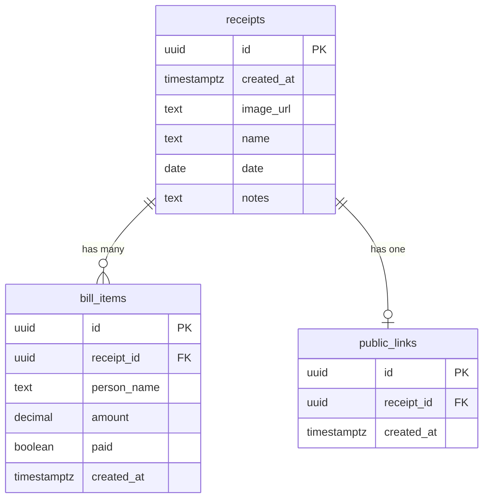

# Database Documentation

This document describes the database schema, relationships, and migrations for Receipt Split.

## Overview

Receipt Split uses **Supabase** as its database provider, which runs on **PostgreSQL**. The database consists of three main tables with relationships between them.

## Entity Relationship Diagram



## Tables

### receipts

The main table storing receipt information.

| Column | Type | Nullable | Default | Description |
|--------|------|----------|---------|-------------|
| `id` | UUID | No | `gen_random_uuid()` | Primary key |
| `created_at` | TIMESTAMPTZ | Yes | `NOW()` | Record creation timestamp |
| `image_url` | TEXT | Yes | - | URL to receipt image in Supabase Storage |
| `name` | TEXT | No | - | Receipt name/title |
| `date` | DATE | No | `CURRENT_DATE` | Receipt date |
| `notes` | TEXT | Yes | - | Optional notes/comments |

**SQL Definition:**

```sql
CREATE TABLE receipts (
  id UUID PRIMARY KEY DEFAULT gen_random_uuid(),
  created_at TIMESTAMPTZ DEFAULT NOW(),
  image_url TEXT,
  name TEXT NOT NULL,
  date DATE NOT NULL DEFAULT CURRENT_DATE,
  notes TEXT
);
```

---

### bill_items

Stores individual people and amounts for each receipt.

| Column | Type | Nullable | Default | Description |
|--------|------|----------|---------|-------------|
| `id` | UUID | No | `gen_random_uuid()` | Primary key |
| `receipt_id` | UUID | No | - | Foreign key to receipts |
| `person_name` | TEXT | No | - | Name of person who owes |
| `amount` | DECIMAL(10,2) | No | - | Amount owed |
| `paid` | BOOLEAN | No | `FALSE` | Payment status |
| `created_at` | TIMESTAMPTZ | Yes | `NOW()` | Record creation timestamp |

**SQL Definition:**

```sql
CREATE TABLE bill_items (
  id UUID PRIMARY KEY DEFAULT gen_random_uuid(),
  receipt_id UUID NOT NULL REFERENCES receipts(id) ON DELETE CASCADE,
  person_name TEXT NOT NULL,
  amount DECIMAL(10, 2) NOT NULL,
  paid BOOLEAN NOT NULL DEFAULT FALSE,
  created_at TIMESTAMPTZ DEFAULT NOW()
);
```

**Relationships:**
- Foreign key to `receipts.id` with `ON DELETE CASCADE`
- When a receipt is deleted, all associated bill items are automatically deleted

---

### public_links

Stores public sharing links for receipts.

| Column | Type | Nullable | Default | Description |
|--------|------|----------|---------|-------------|
| `id` | UUID | No | `gen_random_uuid()` | Primary key (used in public URL) |
| `receipt_id` | UUID | No | - | Foreign key to receipts |
| `created_at` | TIMESTAMPTZ | Yes | `NOW()` | Record creation timestamp |

**SQL Definition:**

```sql
CREATE TABLE public_links (
  id UUID PRIMARY KEY DEFAULT gen_random_uuid(),
  receipt_id UUID NOT NULL REFERENCES receipts(id) ON DELETE CASCADE,
  created_at TIMESTAMPTZ DEFAULT NOW(),
  UNIQUE(receipt_id)
);
```

**Constraints:**
- `UNIQUE(receipt_id)` - Each receipt can only have one public link
- Foreign key to `receipts.id` with `ON DELETE CASCADE`

**Security Design:**
The public link `id` is separate from the receipt `id`. When sharing a bill, the URL contains the public link ID, not the receipt ID. This ensures:
- Receipt IDs are never exposed publicly
- Only explicitly shared receipts are accessible
- The link can be invalidated by deleting the public_links record

---

## Indexes

Performance indexes for common query patterns:

```sql
-- Index for looking up bill items by receipt
CREATE INDEX idx_bill_items_receipt_id ON bill_items(receipt_id);

-- Index for looking up public links by receipt
CREATE INDEX idx_public_links_receipt_id ON public_links(receipt_id);
```

These indexes optimize:
- Fetching all bill items for a receipt
- Checking if a receipt has a public link
- JOIN operations between tables

---

## Common Queries

### Get all receipts with related data

```sql
SELECT 
  r.*,
  json_agg(DISTINCT bi.*) AS bill_items,
  json_agg(DISTINCT pl.*) AS public_links
FROM receipts r
LEFT JOIN bill_items bi ON bi.receipt_id = r.id
LEFT JOIN public_links pl ON pl.receipt_id = r.id
GROUP BY r.id
ORDER BY r.date DESC;
```

**Supabase equivalent:**

```typescript
const { data } = await supabase
  .from('receipts')
  .select(`
    *,
    bill_items (id, person_name, amount, paid),
    public_links (id)
  `)
  .order('date', { ascending: false })
```

### Get single receipt

```typescript
const { data } = await supabase
  .from('receipts')
  .select(`
    *,
    bill_items (id, person_name, amount, paid),
    public_links (id)
  `)
  .eq('id', receiptId)
  .single()
```

### Get public bill by link ID

```typescript
// First, get the receipt_id from the public link
const { data: link } = await supabase
  .from('public_links')
  .select('receipt_id')
  .eq('id', linkId)
  .single()

// Then, fetch the receipt
const { data: receipt } = await supabase
  .from('receipts')
  .select(`*, bill_items (id, person_name, amount, paid)`)
  .eq('id', link.receipt_id)
  .single()
```

### Calculate total for a receipt

```sql
SELECT SUM(amount) as total
FROM bill_items
WHERE receipt_id = 'uuid-here';
```

---

## Migrations

Database migrations are stored in the `migrations/` folder.

### 001_add_notes_column.sql

**Purpose:** Adds a separate `notes` column and renames the original `notes` column to `name`.

**Background:** Originally, the `notes` field was used for the receipt name. This migration separates the two concepts.

**Changes:**
1. Rename `notes` → `name`
2. Add new `notes` column for actual notes

**SQL:**

```sql
-- Rename notes to name
ALTER TABLE receipts RENAME COLUMN notes TO name;

-- Add new notes column
ALTER TABLE receipts ADD COLUMN notes TEXT;
```

---

## Data Types

### UUID

All primary keys use PostgreSQL's native UUID type with automatic generation:

```sql
id UUID PRIMARY KEY DEFAULT gen_random_uuid()
```

Benefits:
- Globally unique identifiers
- No sequential guessing
- Safe for public exposure (in public links)

### DECIMAL(10, 2)

Used for monetary amounts:
- 10 total digits
- 2 decimal places
- Exact precision (no floating-point errors)

### TIMESTAMPTZ

Timestamp with timezone for all date/time fields:
- Stored in UTC
- Automatically converted to user's timezone
- Consistent across time zones

---

## Supabase Storage

In addition to the database, Receipt Split uses Supabase Storage for receipt images.

### Bucket Configuration

| Setting | Value |
|---------|-------|
| Bucket Name | `receipts` |
| Access | Public |
| File Types | Images (jpeg, png, webp, etc.) |

### File Naming

Files are named with timestamp and random string:
```
{timestamp}-{random}.{extension}
```

Example: `1705123456789-abc123.jpg`

### Public URLs

Images are accessed via public URLs:
```
https://{project}.supabase.co/storage/v1/object/public/receipts/{filename}
```

---

## Schema Setup

To set up the database for a new installation:

### 1. Run the schema file

In Supabase SQL Editor, run the contents of `supabase-schema.sql`:

```sql
-- Receipt Split App Database Schema

-- Receipts table
CREATE TABLE receipts (
  id UUID PRIMARY KEY DEFAULT gen_random_uuid(),
  created_at TIMESTAMPTZ DEFAULT NOW(),
  image_url TEXT,
  name TEXT NOT NULL,
  date DATE NOT NULL DEFAULT CURRENT_DATE,
  notes TEXT
);

-- Bill items table
CREATE TABLE bill_items (
  id UUID PRIMARY KEY DEFAULT gen_random_uuid(),
  receipt_id UUID NOT NULL REFERENCES receipts(id) ON DELETE CASCADE,
  person_name TEXT NOT NULL,
  amount DECIMAL(10, 2) NOT NULL,
  paid BOOLEAN NOT NULL DEFAULT FALSE,
  created_at TIMESTAMPTZ DEFAULT NOW()
);

-- Public links table
CREATE TABLE public_links (
  id UUID PRIMARY KEY DEFAULT gen_random_uuid(),
  receipt_id UUID NOT NULL REFERENCES receipts(id) ON DELETE CASCADE,
  created_at TIMESTAMPTZ DEFAULT NOW(),
  UNIQUE(receipt_id)
);

-- Indexes
CREATE INDEX idx_bill_items_receipt_id ON bill_items(receipt_id);
CREATE INDEX idx_public_links_receipt_id ON public_links(receipt_id);
```

### 2. Apply migrations (if needed)

For existing databases, check and apply migrations from the `migrations/` folder.

### 3. Create storage bucket

1. Go to Supabase Dashboard → Storage
2. Create bucket named `receipts`
3. Set to Public access

---

## Data Integrity

### Cascade Deletes

All foreign keys use `ON DELETE CASCADE`:
- Deleting a receipt automatically deletes all bill_items
- Deleting a receipt automatically deletes its public_link
- No orphaned records

### Constraints

| Table | Constraint | Purpose |
|-------|------------|---------|
| receipts | `name NOT NULL` | Every receipt must have a name |
| receipts | `date NOT NULL` | Every receipt must have a date |
| bill_items | `receipt_id NOT NULL` | Every item belongs to a receipt |
| bill_items | `person_name NOT NULL` | Every item must have a name |
| bill_items | `amount NOT NULL` | Every item must have an amount |
| public_links | `UNIQUE(receipt_id)` | One public link per receipt |

---

## Backup and Recovery

### Supabase Automatic Backups

Supabase Pro plans include:
- Daily automatic backups
- Point-in-time recovery
- 7-day retention

### Manual Backup

Export data via Supabase dashboard or pg_dump:

```bash
pg_dump -h db.xxx.supabase.co -U postgres -d postgres > backup.sql
```

### Data Export

Query all data as JSON:

```typescript
// Export all receipts
const { data } = await supabase
  .from('receipts')
  .select(`*, bill_items(*), public_links(*)`)

// Download as JSON
const json = JSON.stringify(data, null, 2)
```

